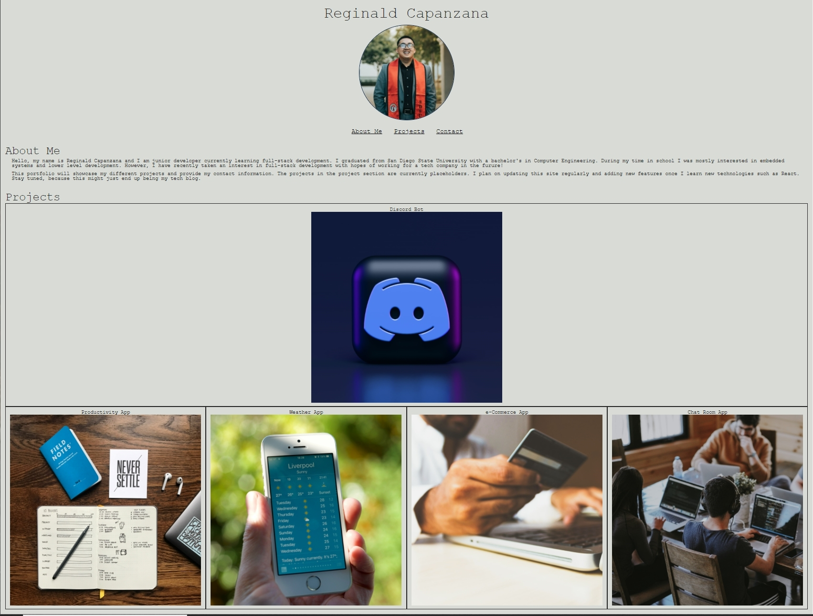

# Portfolio - Reginald Capanzana

## Description
This project is my online portfolio that will be used to showcase my future projects, information about me, and ways to contact me. The projects that are currently displayed are placeholders until I update them with links to their respective repos. 

This project is currently built on CSS and HTML, but I plan to continually update this portfolio as I learn new technologies such as React. The updates to this site will include up-to-date projects, updated front-end design, and maybe a section that will detail my journey into the tech industry!

[Deployed Application](https://reginaldcapanzana.github.io/portfolio/)